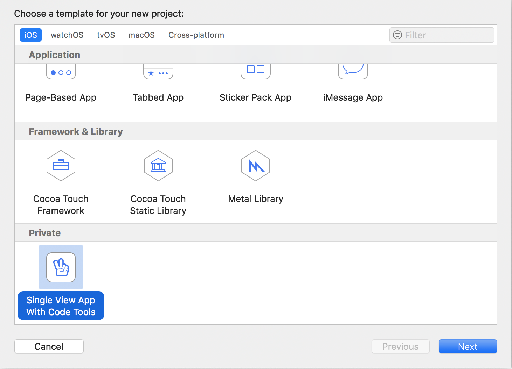
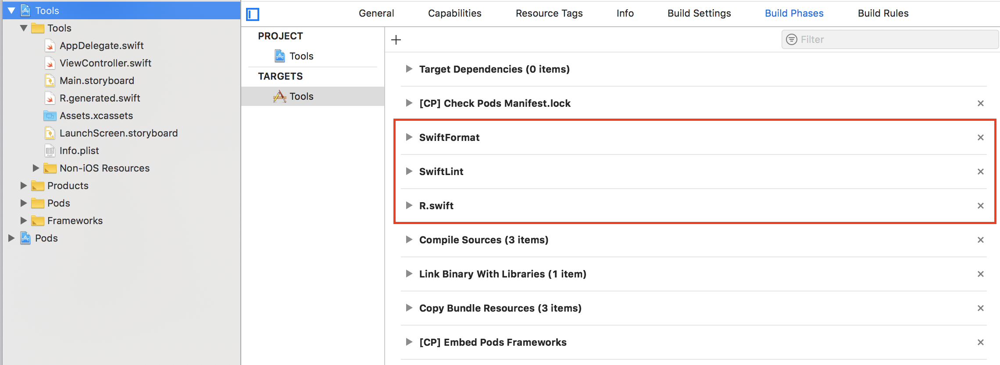

# Xcode Templates

This repository contains useful Xcode templates to simplify new projects up and running.

## Installation

Clone this project and navigate to it via terminal. Run install script:

    chmod +x install.sh
    ./install.sh

This script will copy the templates to `~/Library/Developer/Xcode/Templates/Project Templates/Private` where Xcode will be able to find them. 

## Templates usage

### HandsApp iOS App Template

This template is a copy of default *Single View App* Xcode template without Main.storyboard file and with several handy additions:

* `.gitignore` file;
* [SwiftLint](https://github.com/realm/SwiftLint) build phase integration and configuration file;
* [SwiftFormat](https://github.com/nicklockwood/SwiftFormat) build phase integration;
* [R.Swift](https://github.com/mac-cain13/R.swift) build phase integration;
* `Podfile` to install all the tools mentioned above.
* manual initialozation of UIWindow with root view controller in AppDelegate

#### Up and running

1. Open Xcode and create new project, choose *HandsApp iOS App Template* from the wizard (at the *Private* section);
   
2. Configure project name and other parameters as usual;
3. Close project, navigate to it via terminal and run `pod install` to install the dependencies;
4. Open the generated workspace, navigate to *Build Phases* of your project's main target and **move the SwiftFormat, SwiftLint, and R.Swift script phases above the compile phase** (exactly that order). We have to make this step manually due to limitations of Xcode templates;
   
5. Build project and have fun!

## References

Developing Xcode templates without documentation is hard, so kudos to [Vokal's templates repository](https://github.com/vokal/Xcode-Template) where I was able to find some answers to my questions.
